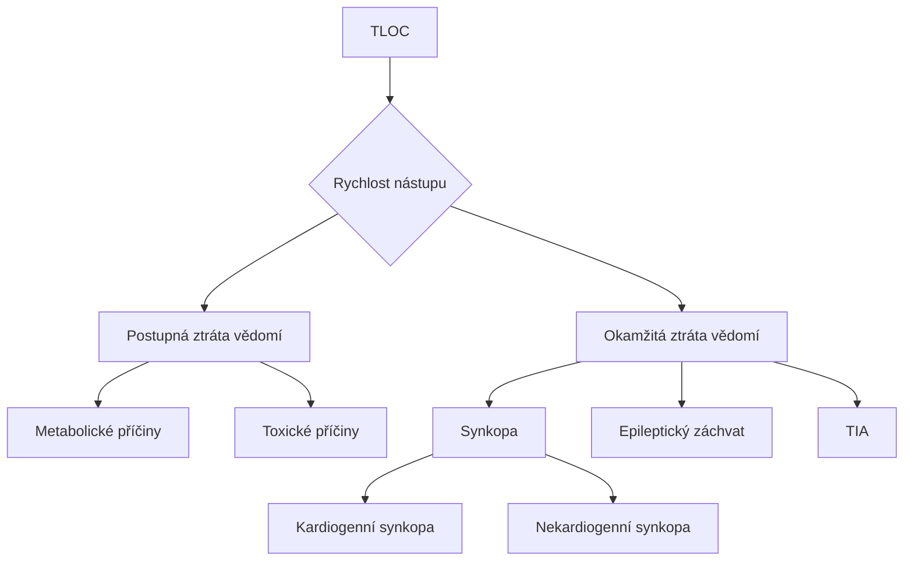

# Vědomí

### Definice vědomí

* **Vědomí** je stav, ve kterém si jedinec **plně uvědomuje sám sebe a své okolí** a je schopen reagovat na podněty z vnějšího prostředí i na vnitřní stimuly.

#### Komponenty vědomí

1. **Vigilita (bdělost / kvantita)**:
   * Schopnost udržet pozornost a reagovat na podněty.
   * Vigilita je základní podmínkou vědomí – musí být přítomna, aby bylo možné vyhodnotit luciditu.
2. **Lucidita (jasnost vědomí / kvalita)**:
   * Umožňuje vědomí a správné chápání vlastní osoby a okolí.
   * Podporuje schopnost logického myšlení a přiměřeného chování.
   * Poškození lucidity může nastat při dezorientaci nebo kvalitativních poruchách vědomí, jako je například delirium.

### Kvantita vědomí

Kvantitativní posouzení vědomí hodnotí **úroveň bdělosti** a dělí ji do několika úrovní na základě reakce pacienta na podněty. Míra bdělosti se snižuje při poruchách vědomí, které mohou přejít až do hlubokého bezvědomí.

#### Stupně kvantitativní poruchy vědomí

1. **Somnolence**:
   * Lehké snížení úrovně vědomí, pacient je spavý, ale **lze ho snadno probudit** běžnými podněty, jako je hlasité oslovení.
   * Po probuzení reaguje přiměřeně, ale rychle se vrací do spánku.
   * Příčiny: např. únava, dehydratace, infekce.
2. **Sopor**:
   * Hlubší útlum vědomí, pacient je spavý a **vyžaduje silnější podněty k probuzení**, jako je bolestivý podnět (štípnutí nebo zatlačení na sternalní oblast).
   * Po probuzení může být zmatený a návrat do spánku je rychlý.
   * Příčiny: např. intoxikace, metabolické poruchy, infekce CNS.
3. **Kóma**:
   * Nejhlubší stupeň kvantitativní poruchy vědomí. Pacient je **zcela nereaktivní na zvukové nebo bolestivé podněty**.
   * V závislosti na závažnosti lze kóma rozdělit na:
     * **Lehké kóma**: Pacient může reagovat reflexními pohyby na silný podnět (např. flexe či extenze končetin).
     * **Hluboké kóma**: Žádná reakce na bolest, pacient nereaguje reflexivně, tělo je zcela ochablé.
   * Příčiny: např. těžké trauma hlavy, cévní mozková příhoda, intoxikace, metabolické selhání.

### Kvalita vědomí

Kvalitativní posouzení vědomí se zaměřuje na **jasnost** a **správnost vnímání** okolního světa a schopnost interpretace smyslových podnětů. Poruchy v této oblasti mohou ovlivnit to, jak jedinec chápe sebe a své okolí, a projevují se zkresleným nebo nesprávným vnímáním.

#### Typy kvalitativních poruch vědomí

1. **Halucinace**
   * Vnímání podnětů, které ve skutečnosti neexistují (např. slyšení hlasů, vidění neexistujících objektů).
   * Mohou být sluchové, zrakové, čichové nebo taktilní.
   * Často se objevují u psychotických stavů, intoxikací nebo neurologických onemocnění.
2. **Iluze**
   * Nesprávná interpretace skutečných podnětů (např. vnímání stínu jako postavy).
   * Vyskytují se obvykle v přechodných stavech (např. únava, zmatenost), ale mohou být i příznakem psychických poruch.
3. **Delirium**
   * Akutní stav zmatenosti, který zahrnuje dezorientaci v čase, prostoru a osobě.
   * Doprovázeno neklidem, halucinacemi a iluzemi.
   * Často způsobeno metabolickými poruchami, intoxikacemi, infekcí nebo vysazením alkoholu (delirium tremens).
4. **Demence**
   * Trvalá a progredující porucha s úbytkem kognitivních funkcí, která ovlivňuje paměť, myšlení a schopnost orientace.
   * Nejčastěji způsobená neurodegenerativními onemocněními, jako je Alzheimerova choroba.
5. **Pseudodemence**
   * Stav připomínající demenci, ale způsobený jinými, často reverzibilními faktory.
   * Příčiny mohou zahrnovat metabolické nebo hormonální poruchy, jako je nedostatek _vitamínu B12_ nebo _hypotyreóza_.
   * Na rozdíl od pravé demence může být pseudodemence léčitelná.

***

### Syndromy

#### Apalický syndrom

Apalický syndrom označuje stav, kdy **kůra mozková nefunguje**, ale **kmen je aktivní**. Pacient je tedy bdělý, ale nemá myšlenky ani schopnost reagovat na podněty.

* **Vegetativní stav**: Další termín pro apalický syndrom, vyjadřující, že hluboké mozkové struktury fungují, zatímco kůra ne.
* **Coma vigile**: Pacient je bdělý, ale bez vědomého myšlení.
* **Locked-out syndrom**: Stav, kdy pacient „ztratil duši“, nevnímá sebe ani okolí.

**Mechanismy vzniku**

* **Trauma**: Například autonehody, pády.
* **Cévní mozková příhoda**: Nedostatečný přísun kyslíku do mozku.
* **Difuzní axiální poranění (DAP)**: Přetržení axonů vlivem rychlé rotace hlavy.

**Prognóza**

Pokud stav trvá déle než 3–6 měsíců, označuje se jako **trvalý vegetativní stav** s velmi nízkou šancí na zotavení.

***

#### Locked-in syndrom

Locked-in syndrom je stav, kdy má pacient plné vědomí, uvědomuje si okolí a je orientovaný, ale je kompletně paralyzovaný, s minimální možností pohybu (často jen očima nebo víčky).

**Příčiny**

* **Poškození mozkového kmene**: Např. krvácení, absces nebo mechanické poranění, které přeruší kortikospinální a kortikobulbární dráhy.
* **Amyotrofická laterální skleróza (ALS)**: Degenerativní onemocnění postupně ničí motorické neurony.
* **Centrální pontinní myelinolýza (CPM)**: Vzniká při rychlé korekci hyponatrémie, což vede k poškození myelinu v oblasti kmene.

**Prognóza**

Locked-in syndrom má špatnou prognózu; pacienti jsou náchylní k dekubitům a infekcím, které často způsobí smrt. Délka přežití je nižší než u vegetativního stavu.

***

#### Locked-out syndrom

Locked-out syndrom je stav, kdy pacient není vědomý, ale základní funkce, jako cyklus spánku a bdění, jsou zachovány. Pacient však nemá schopnost vnímat okolí nebo reagovat na podněty.

**Srovnání s vegetativním stavem**

* **Locked-out syndrom**: Pacient nereaguje na podněty a nevnímá okolí.
* **Vegetativní stav**: Pacient může mít cyklus spánku a bdění a vykazovat reflexní reakce, ale bez vědomí.

***

### Diagnostika přechodné ztráty vědomí (TLOC)

Přechodná ztráta vědomí (TLOC – Transitory Loss of Consciousness) je stav charakterizovaný dočasnou ztrátou vědomí, který trvá od několika sekund po minuty. Při diagnostice se zaměřujeme na dva klíčové aspekty:

* **Rychlost nástupu bezvědomí**
* **Rychlost návratu orientace**

#### Rozdělení podle rychlosti nástupu

**Postupný**

Charakteristika

Pacient postupně upadá do bezvědomí, často s pocity slabosti nebo nevolnosti.

* **Příčiny**:
  * **Metabolické poruchy** (např. hypoglykémie): Pacient cítí hlad nebo slabost, pomalu ztrácí vědomí.
  * **Toxické příčiny** (např. intoxikace alkoholem): Příznaky jako zmatenost nebo nevolnost přecházejí do bezvědomí.

**Okamžitý**

Charakteristika

Pacient náhle ztrácí vědomí bez předchozích příznaků.

* **Příčiny**:
  * **Synkopa**: Rychlá hypoperfuze mozku způsobí, že pacient náhle upadne do bezvědomí, ale po pádu se rychle zotaví.
  * **Epileptický záchvat (tonicko-klonický)**: Záchvat začíná náhle, pacient upadá do tonicko-klonických křečí.
  * **Tranzitorní ischemická ataka (TIA)**: Krátkodobá ischemie mozku, zejména v oblasti mozkového kmene.

#### Rozdělení podle rychlosti návratu orientace

**Rychlý**

Charakteristika

Pacient se rychle orientuje po pádu, vědomí se obnovuje téměř okamžitě.

* **Typické příčiny**:
  * **Synkopa**: Náhlá a reverzibilní ztráta vědomí způsobená hypoperfuzí mozku. Po pádu, když je hlava v úrovni srdce, se perfuze obnoví a pacient se rychle probouzí.

**Pomalý**

Charakteristika

Pacient je po návratu do vědomí zmatený, může být somnolentní a dezorientovaný.

* **Typické příčiny**:
  * **Epileptický záchvat (tonicko-klonický)**: Po záchvatu následuje postiktální zmatenost a únava, která trvá několik minut až desítky minut.
  * **TIA**: Zvláště v případě postižení mozkového kmene může trvat delší dobu, než se pacient plně zotaví.

***

### Synkopa

Synkopa je přechodná ztráta vědomí způsobená **dočasnou hypoperfuzí mozku**. Po synkopě se pacient rychle zotavuje. Synkopy mohou mít různé příčiny a lze je rozdělit na dva základní typy:

#### Kardiogenní synkopa

Způsobená srdečními problémy, zejména arytmiemi.

* **Ventrikulární tachykardie**: Rychlé kontrakce komor, vedoucí ke snížení srdečního výdeje.
* **Bradykardie**: Pomalý tep srdce (např. Sick sinus syndrom).
* **Adam-Stokesův syndrom**: Náhlá ztráta vědomí způsobená arytmií, která může být život ohrožující.

#### Nekardiogenní synkopa

Způsobena poruchami vegetativního nervového systému.

* **Vazovagální synkopa**: Vyvolána stimulací bloudivého nervu (vagus), často u mladých lidí s nízkým krevním tlakem.
* **Mikční synkopa**: Objevuje se při močení, často u mužů po požití alkoholu.
* **Ortostatická synkopa**: Nastává při rychlém postavení z ležící polohy, např. po dlouhém ležení.
* **Situační synkopa**: Spouštěčem mohou být specifické situace, např. Valsalvův manévr nebo hyperventilace.
* **Syndrom karotického sinu**: Vyvolán tlakem na krk, např. holení, utaženou košilí nebo bezpečnostním pásem.

***

#### Rozdíly mezi synkopou a epileptickým záchvatem

Při odlišování synkopy a epileptického záchvatu je klíčové posoudit následující faktory:

* **Postiktální zmatenost**: Po synkopě se pacient rychle orientuje, zatímco po tonicko-klonickém záchvatu může být dezorientovaný po dobu 10–20 minut.
* **Poranění jazyka**: Synkopa obvykle nezpůsobuje pokousání jazyka, zatímco po epileptickém záchvatu může být jazyk poraněn.
* **Bolest svalů**: Po epileptickém záchvatu bývá bolest svalů kvůli tonicko-klonickým křečím.
* **Sfinktery**: Epileptický záchvat často doprovází uvolnění svěračů, zatímco u synkopy je to vzácné.

***

Tato struktura s rozbalitelnými spoilery činí poznámky přehlednější a snadněji čitelné, přičemž zachovává podrobný obsah pro diagnostiku TLOC.

### Glasgow Coma Scale

**GCS**: Nejčastěji používaná škála pro objektivní hodnocení úrovně vědomí. GCS hodnotí tři kategorie:

#### 👁️ Otevření očí

| Odpověď       | Skóre |
| ------------- | ----- |
| Spontánní     | 4     |
| Na zvuk       | 3     |
| Na bolest     | 2     |
| Žádná odpověď | 1     |

#### 🗣️ Verbální odpověď

| Odpověď              | Skóre |
| -------------------- | ----- |
| Orientovaný          | 5     |
| Zmatený              | 4     |
| Nevhodná slova       | 3     |
| Nesrozumitelné zvuky | 2     |
| Žádná odpověď        | 1     |

#### ✋ Motorická odpověď

| Odpověď                         | Skóre |
| ------------------------------- | ----- |
| Plní příkazy                    | 6     |
| Lokalizuje bolest               | 5     |
| Flexe na bolest (decortikace)   | 4     |
| Extenze na bolest (decerebrace) | 3     |
| Žádná odpověď na bolest         | 2     |
| Žádná odpověď                   | 1     |

***

### 13 Příčin bezvědomí (podle R. Pleskota)

[YT video](https://www.youtube.com/watch?v=HTJ7U5UL8UI)

Bezvědomí může mít různé příčiny, které jsou rozděleny do čtyř hlavních kategorií podle strukturálního, funkčního, krevního nebo toxického původu.

#### Strukturální příčiny

Strukturální příčiny souvisejí s poškozením samotné struktury mozku, které ovlivňuje základní oblasti mozkového fungování a často vede k vážným stavům.

1. **🔨 Úraz**
   * Přímé poranění hlavy nebo mozku může vést k bezvědomí kvůli otoku, krvácení nebo poranění mozkových struktur.
2. **🦠 Infekce**
   * Infekce mozkových blan (meningitida) nebo mozku (encefalitida) mohou způsobit závažné poruchy vědomí.
3. **Nádor**
   * Mozkový nádor, který svou přítomností nebo růstem ovlivňuje fungování mozkových struktur a způsobuje útlum vědomí.
4. **🧠 Cévní mozková příhoda (CMP)**
   * Ischemická nebo hemoragická CMP může vést k ischemii mozkové tkáně a následnému poškození vědomí.

#### Funkční příčiny

Funkční příčiny bezvědomí zahrnují poruchy, které ovlivňují mozkovou funkci bez přímého strukturálního poškození.

5. **⚡ Epilepsie**
   * Záchvaty mohou vést k přechodné ztrátě vědomí, zejména při generalizovaném tonicko-klonickém záchvatu.
6. **😵 Psychogenní bezvědomí**
   * Stav, kdy pacient ztrácí vědomí z psychických příčin (např. disociativní porucha), bez organického poškození mozku.

#### Příčiny související s krevními změnami

Tyto příčiny zahrnují chemické změny v krvi, které ovlivňují přísun kyslíku, glukózy nebo jiných klíčových látek do mozku.

7. **🍬 Hypoglykémie**
   * Nízká hladina cukru v krvi může vést k poruše vědomí a následné synkopě nebo kómatu.
8. **🌬️ Hypoxie**
   * Nedostatečný přísun kyslíku do mozku způsobuje nedostatek energie pro mozkové buňky, což vede k bezvědomí.
9. **🫁 Hyperkapnie**
   * Nadměrná koncentrace oxidu uhličitého v krvi způsobuje poruchy acidobazické rovnováhy, což může utlumit vědomí.
10. **🤒 Změna tělesné teploty**

* Výrazné přehřátí (hypertermie) nebo podchlazení (hypotermie) mohou mít přímý vliv na mozkovou funkci a vést k bezvědomí.

#### Toxické příčiny

Toxické příčiny zahrnují přítomnost látek, které negativně ovlivňují mozkové funkce buď interně (endogenní toxiny) nebo externě (exogenní toxiny).

11. **🤮 Vnitřní toxiny**
    * Jedovaté látky vznikající v těle (např. při jaterním nebo ledvinovém selhání) mohou akumulovat toxické produkty, které narušují vědomí.
12. **💉 Vnější toxiny**
    * Externí toxiny, jako jsou oxid uhelnatý, drogy, alkohol nebo léky, mohou poškozovat nervový systém a způsobovat bezvědomí.

#### 13. příčina – Srdeční zástava

13. **❣️ Srdeční zástava**
    * Specifická prioritní příčina, která vyžaduje okamžitou resuscitaci. Srdeční zástava vede k rychlé ztrátě vědomí z důvodu úplného přerušení krevního oběhu, což způsobuje nedostatek kyslíku v mozku. Tato příčina je první, kterou je třeba vyloučit nebo řešit u pacienta v bezvědomí.
